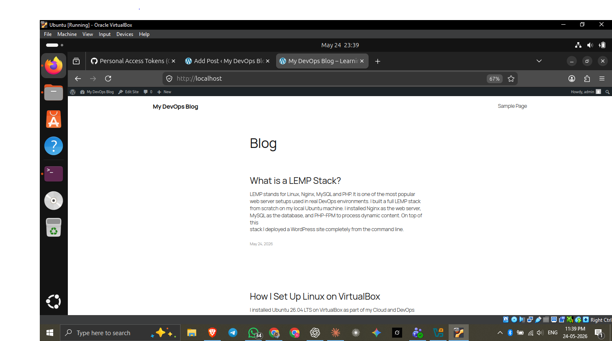

# WordPress Deployment on Ubuntu Using LEMP Stack 🚀

A complete guide to deploying WordPress on a local Ubuntu machine 
using Nginx, MySQL, and PHP — built as part of my Cloud & DevOps learning journey.

---

## 🧱 What is a LEMP Stack?

| Letter | Technology | Role |
|--------|-----------|------|
| L | Linux (Ubuntu 26.04) | Operating System |
| E | Nginx | Web Server |
| M | MySQL | Database |
| P | PHP 8.5 | Backend Language |

---

## 🖥️ Environment

- OS: Ubuntu 26.04 LTS (Resolute)
- Platform: VirtualBox
- Web Server: Nginx
- Database: MySQL
- Language: PHP 8.5-FPM

---

## 📋 Prerequisites

- Ubuntu installed (VirtualBox, Dual Boot, or WSL)
- Terminal access with sudo privileges
- Basic Linux command knowledge

---

## ⚙️ Installation Steps

### 1. Update System
```bash
sudo apt update && sudo apt upgrade -y
```

### 2. Install Nginx
```bash
sudo apt install nginx -y
sudo systemctl start nginx
sudo systemctl enable nginx
```

### 3. Install MySQL
```bash
sudo apt install mysql-server -y
sudo systemctl start mysql
sudo systemctl enable mysql
sudo mysql_secure_installation
```

### 4. Install PHP 8.5 and Extensions
```bash
sudo apt install php8.5-fpm php8.5-mysql php8.5-curl \
php8.5-gd php8.5-mbstring php8.5-xml php8.5-zip -y
```

### 5. Create MySQL Database and User
```bash
sudo mysql -u root
```
```sql
CREATE DATABASE wordpress_db;
CREATE USER 'wp_user'@'localhost' IDENTIFIED BY 'YourPassword';
GRANT ALL PRIVILEGES ON wordpress_db.* TO 'wp_user'@'localhost';
FLUSH PRIVILEGES;
EXIT;
```

### 6. Download and Configure WordPress
```bash
cd /tmp
wget https://wordpress.org/latest.tar.gz
tar -xvzf latest.tar.gz
sudo mv wordpress /var/www/html/wordpress
```

### 7. Set File Permissions
```bash
sudo chown -R www-data:www-data /var/www/html/wordpress
sudo chmod -R 755 /var/www/html/wordpress
sudo chmod -R 775 /var/www/html/wordpress/wp-content
```

### 8. Configure WordPress
```bash
cd /var/www/html/wordpress
sudo cp wp-config-sample.php wp-config.php
sudo nano wp-config.php
```
Update these lines:
```php
define( 'DB_NAME', 'wordpress_db' );
define( 'DB_USER', 'wp_user' );
define( 'DB_PASSWORD', 'YourPassword' );
define( 'DB_HOST', 'localhost' );
```

### 9. Configure Nginx
```bash
sudo nano /etc/nginx/sites-available/wordpress
```
Paste this config:
```nginx
server {
    listen 80;
    server_name localhost;

    root /var/www/html/wordpress;
    index index.php index.html index.htm;

    location / {
        try_files $uri $uri/ /index.php?$args;
    }

    location ~ \.php$ {
        include snippets/fastcgi-php.conf;
        fastcgi_pass unix:/run/php/php8.5-fpm.sock;
        fastcgi_param SCRIPT_FILENAME $document_root$fastcgi_script_name;
        include fastcgi_params;
    }

    location ~ /\.ht {
        deny all;
    }
}
```
Enable the site:
```bash
sudo ln -s /etc/nginx/sites-available/wordpress /etc/nginx/sites-enabled/
sudo rm /etc/nginx/sites-enabled/default
sudo nginx -t
sudo systemctl reload nginx
```

### 10. Complete Installation
Open browser and go to: http://localhost

Follow the WordPress installation wizard. ✅

---

## 🔑 Key Concepts Learned

- **Principle of Least Privilege** — Created a dedicated MySQL user instead of using root
- **File Permissions** — Used `chown` and `chmod` to set correct ownership for Nginx
- **PHP-FPM** — Connects Nginx to PHP via Unix socket
- **Nginx Server Block** — Configured virtual host for WordPress
- **`nginx -t`** — Always test config before reloading in production

---

## 📸 Result

WordPress site successfully deployed and running at `http://localhost`



---

## 👤 Author

**abdul haseeb**
- Medium: [medium.com/@haseebabdul480](https://medium.com/@haseebabdul480)
- GitHub: [github.com/haseebspaniard](https://github.com/haseebspaniard)

---

## 📚 Part of My Cloud & DevOps Journey

This project is part of my ongoing Cloud & DevOps course.
Follow my learning journey on Medium where I document everything I learn.
